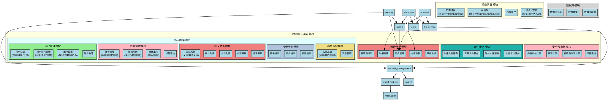
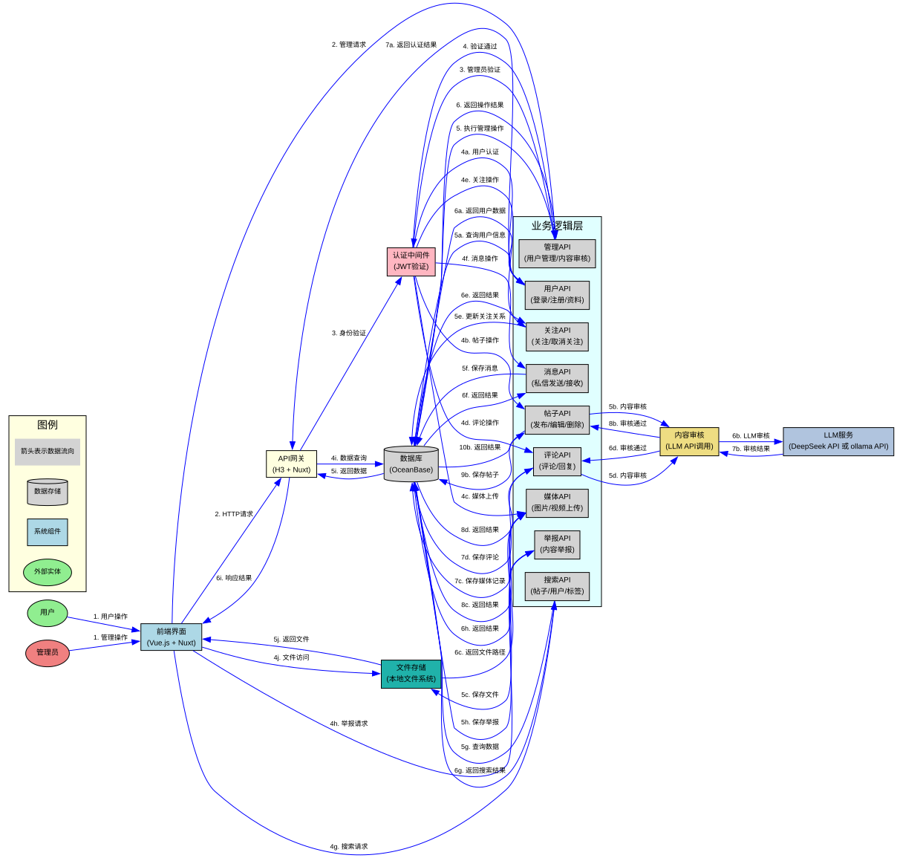
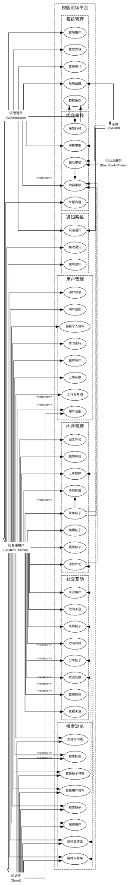
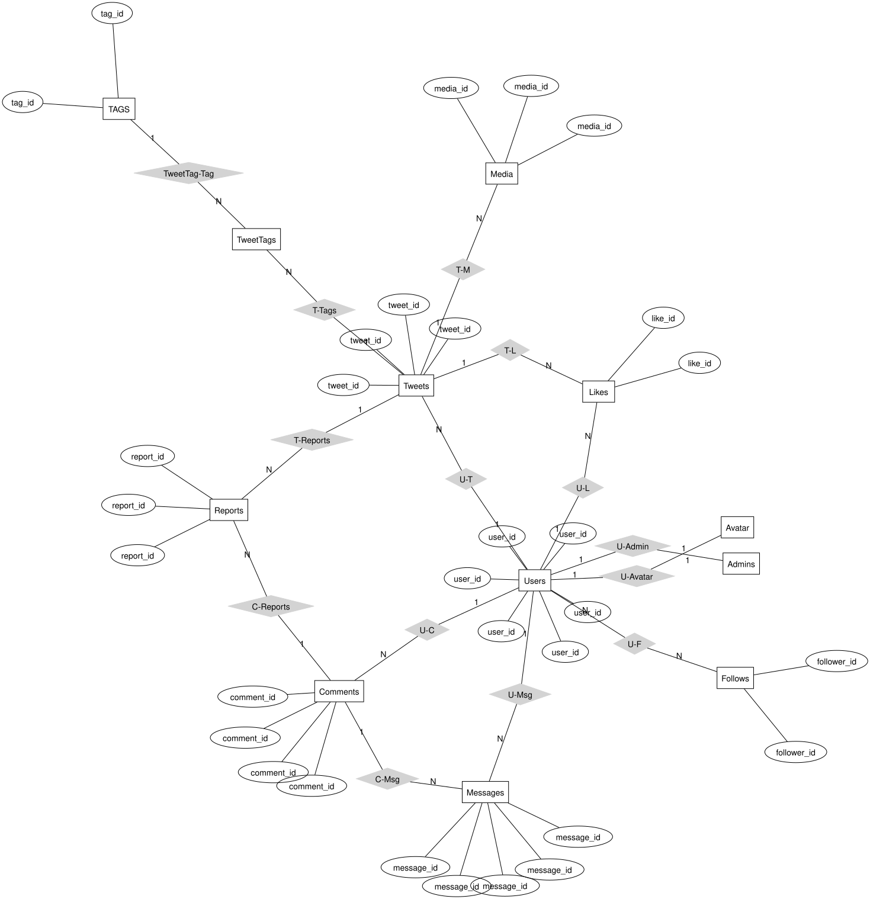
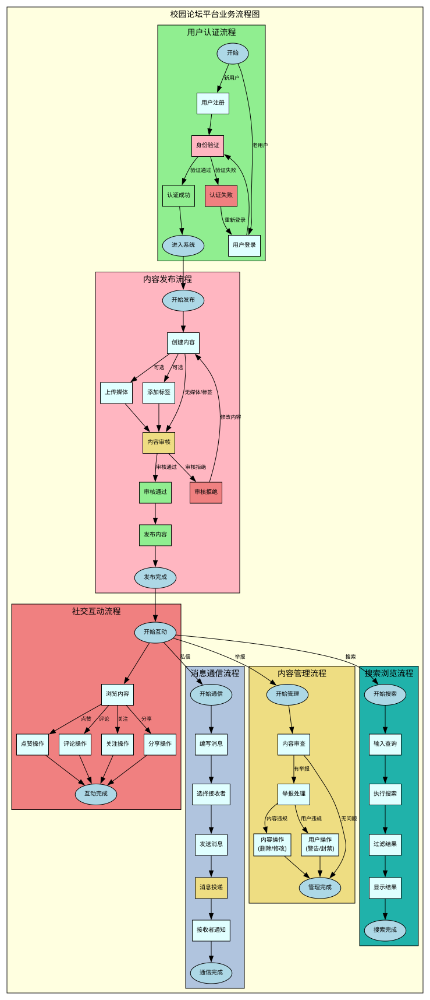
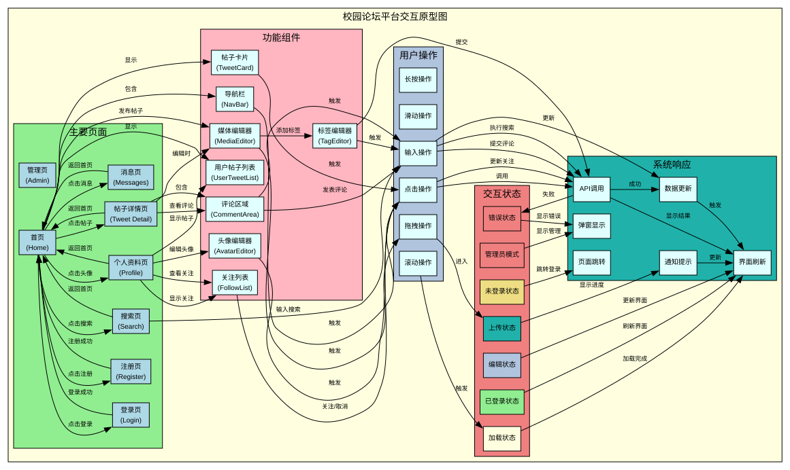
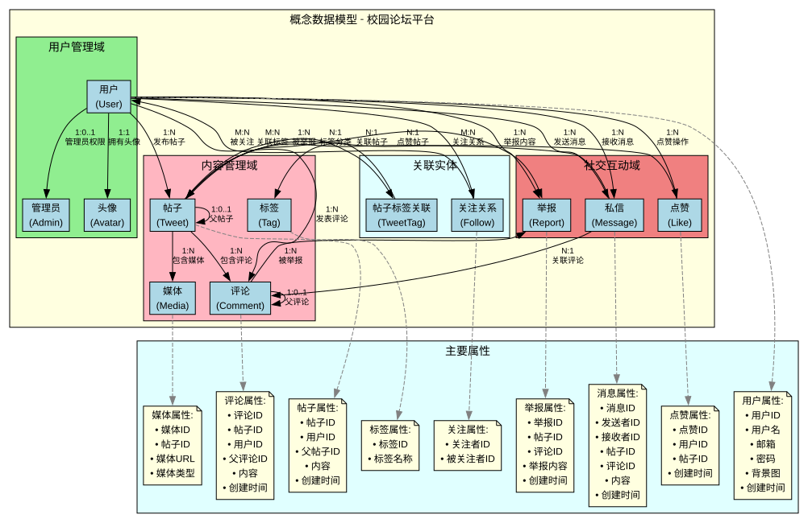
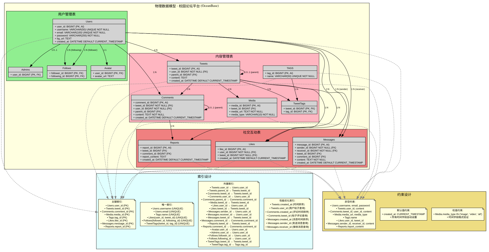
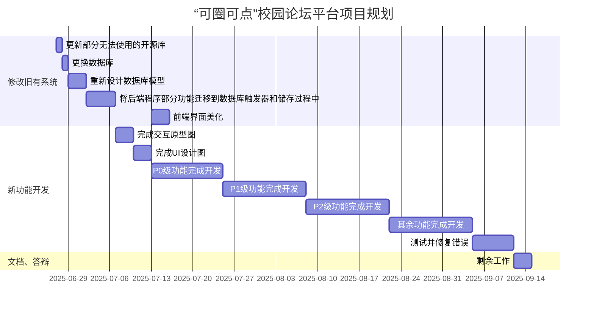

# “可圈可点”校园论坛平台产品文档

## 需求背景
随着高校信息化建设的推进，传统的校园交流方式（如线下公告、QQ群、微信群等）已难以满足现代大学生在**信息获取、兴趣交流、资源共享**等方面的多样化需求。同时，现有的社交平台在校园内容聚合与话题沉淀方面存在局限，例如内容更新快但组织松散、缺乏针对高校的定制功能等。

因此，开发一个**面向在校学生的校园论坛平台**，旨在为学生提供一个更具归属感、秩序性和实用性的互动社区，帮助实现更高效的校园沟通与信息共享。

### 用户调研
#### 目标用户
- **核心用户群**：高校在校学生（本科生、研究生）
- **潜在用户群**：教师、校友、学生组织、校园创业团队等

#### 用户痛点
- 信息分散在多个平台，不易系统化检索
- 社交平台非匿名环境下不利于吐槽和表达观点
- 课程资料/学习资源获取效率低，二手交易信息混乱
- 缺乏一个既可公开交流又有一定“校园内圈”氛围的平台

#### 关键用户需求总结
| 需求类型 | 具体内容                        |
| ---- | --------------------------- |
| 信息获取 | 想要快速获取校内讲座通知、课程信息、活动消息等     |
| 兴趣交流 | 寻找志同道合者参与讨论（如动漫、技术、考研、出国）   |
| 资源共享 | 分享/获取资料、二手交易（书籍、电子设备）、租房信息等 |
| 账号管理 | 希望可通过学号/学校邮箱绑定，保障社区实名可控     |
| 内容管理 | 希望内容有标签分类、置顶/热门推荐、评论互动功能    |
| 反馈机制 | 需支持举报、私信、点赞收藏等基本社区互动功能      |

### 竞品分析

#### 1. 综合社交平台（如 QQ 群 / 微信群）

| 优势            | 劣势                    |
| ------------- | --------------------- |
| 即时通信强，学生使用频率高 | 信息流混乱、历史消息难以检索、话题沉淀性差 |
| 易于组织活动、通知事件   | 无内容分区、无搜索分类、缺乏社区结构    |
#### 2. 学生自建贴吧 / 微博校园圈子

| 优势            | 劣势                 |
| ------------- | ------------------ |
| 可半匿名讨论、支持兴趣标签 | 管理松散、广告和无关内容多、缺乏维护 |
| 具有一定社群氛围      | 内容刷新快但结构性差、功能较为有限  |

#### 3. 国内部分高校自研校园论坛（如水木社区、北邮人、树洞）

|优势|劣势|
|---|---|
|针对性强，功能贴近学生需求|多为老旧架构、移动端体验差|
|有校园氛围、话题沉淀好|扩展性不强，技术栈更新慢|

## 需求范围

### 用户管理

| 功能点              | 对应需求 | 优先级 | 负责人 | 状态  |
| ---------------- | ---- | --- | --- | --- |
| 用户鉴权（登录、注册、退出登录） | 账号管理 | P0  | 古佳乐 | 已完成 |
| 用户资料管理（头像、邮箱、昵称） | 账号管理 | P0  | 古佳乐 | 已完成 |
| 用户互动功能（关注、粉丝统计）  | 反馈机制 | P1  |     | 已完成 |
| 举报、私信等社区功能       | 反馈机制 | P2  |     | 已完成 |
| 用户搜索功能            | 信息获取 | P1  |     | 已完成 |
| 用户个人资料页面         | 账号管理 | P1  |     | 已完成 |
| 用户关注/取消关注        | 反馈机制 | P1  |     | 已完成 |
| 用户粉丝列表查看         | 反馈机制 | P1  |     | 已完成 |
| 用户关注列表查看         | 反馈机制 | P1  |     | 已完成 |

### 帖子管理

| 功能点           | 对应需求      | 优先级 | 负责人 | 状态  |
| ------------- | --------- | --- | --- | --- |
| 获取并展示帖子       | 信息获取      | P0  | 古佳乐 | 已完成 |
| 用户发布帖子        | 兴趣交流、资源共享 | P0  | 古佳乐 | 已完成 |
| 帖子互动功能（点赞、评论） | 内容管理      | P0  | 古佳乐 | 已完成 |
| 用户删除、修改已发布的帖子 |           | P1  |     | 已完成 |
| 帖子添加标签功能      | 内容管理      | P1  |     | 已完成 |
| 根据标签分类展示帖子    | 信息获取、内容管理 | P1  |     | 已完成 |
| 转发帖子功能        |           | P1  |     | 已完成 |
| 仅查看已关注的用户的帖子  | 信息获取      | P2  |     | 已完成 |
| 帖子分页展示         | 信息获取      | P1  |     | 已完成 |
| 帖子时间排序（升序/降序） | 信息获取      | P1  |     | 已完成 |
| 帖子详情页面         | 信息获取      | P1  |     | 已完成 |
| 帖子搜索功能         | 信息获取      | P1  |     | 已完成 |

### 帖子内容

| 功能点               | 对应需求 | 优先级 | 负责人 | 状态  |
| ----------------- | ---- | --- | --- | --- |
| 帖子展示文本内容          |      | P0  | 古佳乐 | 已完成 |
| 展示多媒体内容（视频、图片）    |      | P0  | 古佳乐 | 已完成 |
| 展示评论区             | 反馈机制 | P0  | 古佳乐 | 已完成 |
| 媒体文件上传功能         | 资源共享 | P1  |     | 已完成 |
| 头像和背景图片上传       | 账号管理 | P1  |     | 已完成 |
| Markdown 内容支持      | 内容管理 | P1  |     | 已完成 |
| bilibili iframe 内容支持      | 内容管理 | P2  |     | 已完成 |
| youtube iframe 内容支持      | 内容管理 | P2  |     | 已完成 |

### 评论系统

| 功能点           | 对应需求 | 优先级 | 负责人 | 状态  |
| ------------- | ---- | --- | --- | --- |
| 评论发布功能         | 反馈机制 | P0  |     | 已完成 |
| 评论分页展示         | 反馈机制 | P1  |     | 已完成 |
| 评论删除功能         | 反馈机制 | P1  |     | 已完成 |
| 评论回复功能         | 反馈机制 | P1  |     | 已完成 |
| 评论时间排序         | 反馈机制 | P1  |     | 已完成 |

### 消息系统

| 功能点           | 对应需求 | 优先级 | 负责人 | 状态  |
| ------------- | ---- | --- | --- | --- |
| 私信发送功能         | 反馈机制 | P1  |     | 已完成 |
| 私信接收功能         | 反馈机制 | P1  |     | 已完成 |
| 消息列表查看         | 反馈机制 | P1  |     | 已完成 |
| 消息删除功能         | 反馈机制 | P1  |     | 已完成 |
| 批量删除消息         | 反馈机制 | P1  |     | 已完成 |
| 消息搜索功能         | 反馈机制 | P1  |     | 已完成 |

### 内容分类与标签

| 功能点           | 对应需求 | 优先级 | 负责人 | 状态  |
| ------------- | ---- | --- | --- | --- |
| 校园话题分类         | 信息获取 | P1  |     | 已完成 |
| 表白墙功能          | 兴趣交流 | P1  |     | 已完成 |
| 帮帮墙功能          | 资源共享 | P1  |     | 已完成 |
| 校园资讯展示         | 信息获取 | P1  |     | 已完成 |
| 标签过滤和排序       | 内容管理 | P1  |     | 已完成 |
| 热门标签统计         | 内容管理 | P1  |     | 已完成 |

### 搜索功能

| 功能点           | 对应需求 | 优先级 | 负责人 | 状态  |
| ------------- | ---- | --- | --- | --- |
| 推文关键词搜索       | 信息获取 | P1  |     | 已完成 |
| 用户搜索功能         | 信息获取 | P1  |     | 已完成 |
| 搜索结果分页         | 信息获取 | P1  |     | 已完成 |
| 搜索结果排序         | 信息获取 | P1  |     | 已完成 |

### 管理功能

| 功能点           | 对应需求 | 优先级 | 负责人 | 状态  |
| ------------- | ---- | --- | --- | --- |
| 用户管理功能         | 内容管理 | P1  |     | 已完成 |
| 举报管理功能         | 内容管理 | P1  |     | 已完成 |
| 管理员权限控制       | 内容管理 | P1  |     | 已完成 |
| 内容审核功能         | 内容管理 | P1  |     | 已完成 |

### 其他功能

| 功能点       | 对应需求 | 优先级 | 负责人 | 状态  |
| --------- | ---- | --- | --- | --- |
| 深色模式主题    |      | P1  | 古佳乐 | 已完成 |
| 国际化功能（英文） |      | P1  | 古佳乐 | 已完成 |
| 响应式设计      |      | P1  |     | 已完成 |
| 地图功能       |      | P2  |     | 已完成 |
| 分页导航       |      | P1  |     | 已完成 |
| 错误处理       |      | P1  |     | 已完成 |

### 其他工作内容

#### 功能改进

| 需求 | 优先级 | 负责人 | 状态  |
| --------- | --- | --- | --- |
| 前端界面优化 | P3 |    | 已完成 |
| 翻译文本优化 | P3 |    | 已完成 |
| 后端接口文档优化 | P3 |    | 已完成 |
| nuxt 版本迁移 | P3 |    | 已完成 |
| javascript 迁移至 typescript | P3 |    | 已完成 |

#### 部署

| 需求   | 优先级 | 负责人 | 状态  |
| ---------  | --- | --- | --- |
| CI/CD  | P1 |    | 已完成 |
| Dockerfile 与 docker-compose.yaml | P1 |    | 已完成 |
| ecosystem.config | P1 |    | 已完成 |

#### 代码管理

| 需求  | 优先级 | 负责人 | 状态  |
| --------- | --- | --- | --- |
| eslint 与 prettier 配置 | P1 |    | 已完成 |

#### 文档

| 需求  | 优先级 | 负责人 | 状态  |
| ---------  | --- | --- | --- |
| 安装部署说明书 | P2 |    | 已完成 |
| 自述文件 | P2 |    | 已完成 |
| 产品文档 | P2 |    | 已完成 |
| 开发文档 | P2 |    | 已完成 |
| 数据库建模报告 | P2 |    | 已完成 |
| 需求分析报告 | P2 |    | 已完成 |
| SQL 编程报告 | P2 |    | 已完成 |
| 实训大作业报告 | P2 |    | 进行中 |

## 功能详细说明

### 功能模块图

### 数据流图

### 用例图

### ER 图

### 业务流程图

### 交互原型图

### 数据模型

#### CDM

#### PDM

## 项目规划

本项目基于[推特山寨版](https://github.com/gujial/twitter-clone)开发，为符合 LJ 要求，需做出以下改动：
- 更新部分无法使用的开源库
- 更换数据库
- 重新设计数据库模型
- 将后端程序部分功能迁移到数据库触发器和储存过程中
- 前端界面美化
- 添加新增功能、移除或修改个别旧功能
- 添加校园表白墙功能
- 添加校园帮帮墙功能
- 添加校园资讯展示

本项目开发起止日期为 2025/7/4~2020/9/14

